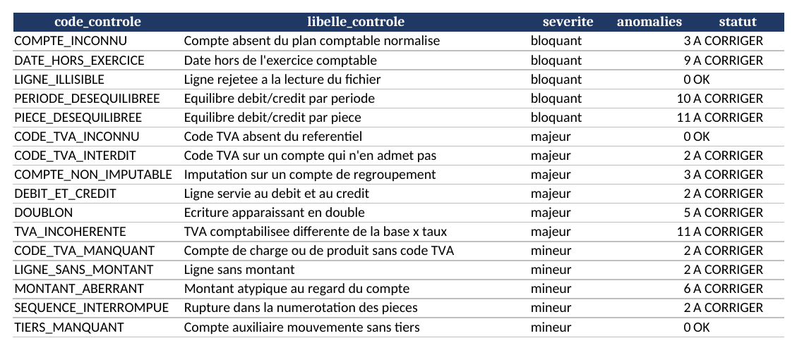
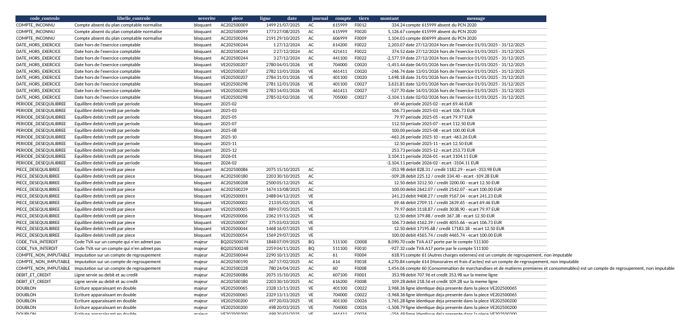
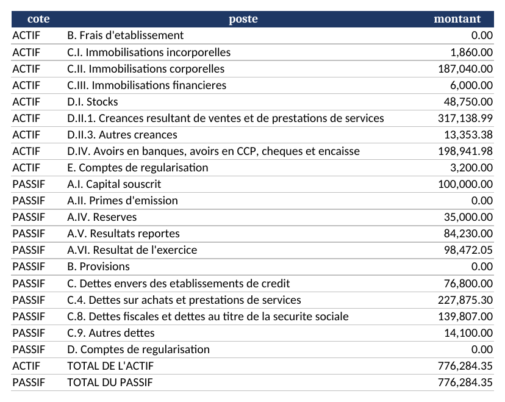
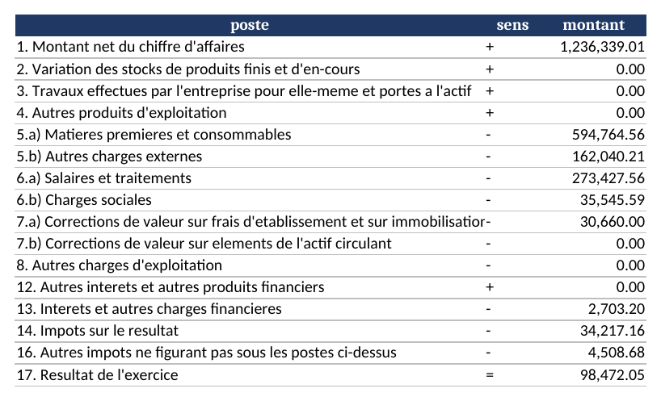
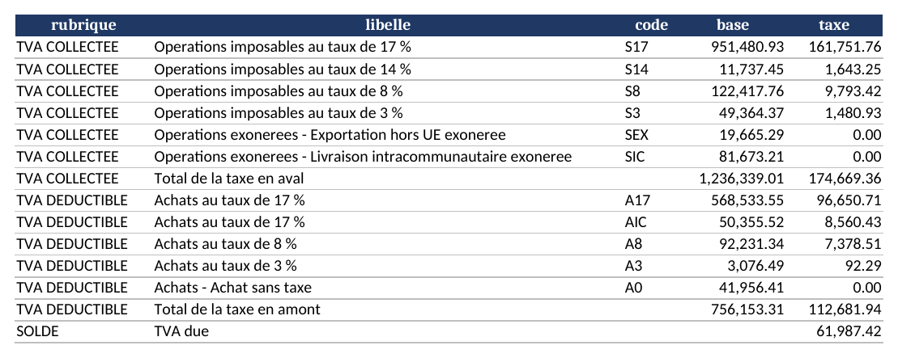

# lux-ledger-analytics

[](https://github.com/cyrilportfolio/lux-ledger-analytics/actions/workflows/ci.yml)

**Contrôle qualité et restitutions automatisées sur un grand livre tenu au Plan Comptable Normalisé luxembourgeois (PCN 2020).**
*Quality checks and automated reporting on a general ledger kept under the Luxembourg standard chart of accounts (PCN 2020).*

Python · pandas · openpyxl · pytest · Docker
[Français](#français) — [English](#english)

---

## Français

### Le problème

En fiduciaire luxembourgeoise, la reprise d'un dossier commence toujours par les mêmes questions : les pièces sont-elles équilibrées, les comptes existent-ils au PCN, les codes TVA tiennent-ils la route, la balance mène-t-elle à des états cohérents. Ces vérifications se font souvent à la main, dossier par dossier.

Ce dépôt industrialise ce premier passage. Il lit un export d'écritures, applique seize contrôles, produit la balance, le bilan, le compte de profits et pertes, un projet de déclaration TVA et un rapport d'anomalies exploitable — en une commande.

### Ce que fait le pipeline

1. **Ingestion** — lecture d'un journal exporté au format français : séparateur `;`, virgule décimale, dates `JJ/MM/AAAA`, cellules vides pour les montants nuls, numéros de compte conservés en texte. Les lignes illisibles sont mises de côté et signalées, jamais supprimées en silence.
2. **Contrôles** — seize contrôles hiérarchisés en trois niveaux de gravité (bloquant, majeur, mineur).
3. **Restitutions** — balance générale, balances auxiliaires clients et fournisseurs, bilan et compte de profits et pertes agrégés par le tableau de passage du PCN, déclaration TVA par taux, le tout dans un classeur Excel mis en forme, plus un rapport d'anomalies en texte.
4. **Extrait FAIA** — export XML calqué sur la structure du Fichier d'Audit Informatisé de l'AED (option `--faia`).

### Les contrôles

| Code | Ce qui est vérifié | Gravité |
|---|---|---|
| `PIECE_DESEQUILIBREE` | Débit = crédit sur chaque pièce, au centime | bloquant |
| `PERIODE_DESEQUILIBREE` | Débit = crédit sur chaque période | bloquant |
| `COMPTE_INCONNU` | Le compte existe au référentiel PCN 2020 | bloquant |
| `DATE_HORS_EXERCICE` | La date d'écriture tombe dans l'exercice | bloquant |
| `LIGNE_ILLISIBLE` | La ligne a pu être lue et typée | bloquant |
| `COMPTE_NON_IMPUTABLE` | Aucune imputation sur un compte de regroupement | majeur |
| `TVA_INCOHERENTE` | TVA comptabilisée = base × taux du code, pièce par pièce | majeur |
| `CODE_TVA_INTERDIT` | Pas de code TVA sur les classes 1 et 5 ni sur les comptes de TVA | majeur |
| `CODE_TVA_INCONNU` | Le code TVA existe au référentiel | majeur |
| `DOUBLON` | Aucune ligne strictement identique répétée | majeur |
| `DEBIT_ET_CREDIT` | Une ligne est débitrice ou créditrice, jamais les deux | majeur |
| `MONTANT_ABERRANT` | Montant très éloigné de la médiane de son propre compte | mineur |
| `CODE_TVA_MANQUANT` | Les comptes de charges et de produits des journaux VE et AC portent un code | mineur |
| `LIGNE_SANS_MONTANT` | Aucune ligne à zéro | mineur |
| `SEQUENCE_INTERROMPUE` | La numérotation des pièces d'un journal ne saute pas de numéro | mineur |
| `TIERS_MANQUANT` | Les comptes auxiliaires portent un code tiers | mineur |

La distinction **compte d'imputation / compte de regroupement** est propre au PCN 2020 : le règlement grand-ducal du 12 septembre 2019 rend cette séparation obligatoire, et un logiciel qui laisse imputer sur un compte à deux chiffres produit une balance impossible à déposer.

Le contrôle TVA ne compare pas des totaux : il recalcule, **pièce par pièce**, la taxe attendue à partir de chaque base portant un code, puis la confronte au montant réellement porté au compte de TVA correspondant. L'autoliquidation intracommunautaire est traitée comme telle (TVA due et TVA déductible sur la même pièce) et ne remonte pas en anomalie.

### Les jeux de données

Tout est **synthétique**. Aucune donnée client, aucun nom réel, aucun montant réel.

| Fichier | Contenu |
|---|---|
| `data/pcn_2020.csv` | Référentiel de comptes : classe, imputable ou non, sens normal, rubrique et poste du tableau de passage |
| `data/tva_codes.csv` | Codes TVA, taux, sens, compte de TVA rattaché |
| `data/postes.csv` | Ordre et sens des postes du bilan et du compte de profits et pertes |
| `data/journal_clean.csv` | Un exercice complet, ~2 800 lignes, ~1 070 pièces, toutes équilibrées |
| `data/journal_dirty.csv` | Le même exercice, avec des défauts injectés volontairement |
| `data/anomalies_attendues.csv` | La liste de ces défauts, qui sert de vérité de référence aux tests |
| `data/tiers.csv` | Annuaire clients et fournisseurs |

L'exercice simulé est celui d'une petite société commerciale luxembourgeoise : 1,24 M€ de chiffre d'affaires, quatre taux de TVA, des livraisons intracommunautaires et des exportations exonérées, une paie mensuelle, un emprunt, des amortissements trimestriels, la déclaration TVA du mois et l'impôt de fin d'exercice (IRC majoré de la contribution au fonds pour l'emploi, plus l'impôt commercial communal).

`generate_data.py` est déterministe : la même graine reproduit les mêmes fichiers.

### Démarrage rapide

```bash
git clone https://github.com/cyrilportfolio/lux-ledger-analytics.git
cd lux-ledger-analytics
pip install -r requirements.txt

make data        # régénère les jeux de données synthétiques
make run         # analyse le journal propre
make run-dirty   # analyse le journal avec anomalies
make test        # 41 tests
```

Sans `make` :

```bash
python -m src.generate_data
python -m src.main --journal data/journal_dirty.csv --faia
python -m pytest
```

Avec Docker :

```bash
docker build -t lux-ledger .
docker run --rm \
  -v "$PWD/data:/app/data" \
  -v "$PWD/output:/app/output" \
  lux-ledger --journal data/journal_dirty.csv --faia
```

Options de la ligne de commande : `--journal`, `--pcn`, `--tva`, `--postes`, `--tiers`, `--output`, `--debut`, `--fin`, `--entite`, `--numero-tva`, `--faia`, `--strict`, `--silencieux`. `--strict` renvoie le code de sortie `2` dès qu'une anomalie bloquante est détectée, ce qui permet d'arrêter une chaîne de traitement automatisée.

### Ce que ça donne

```
CONTROLES
  statut      severite  anomalies  libelle_controle
  -------------------------------------------------------------------------------
  A CORRIGER  bloquant  3          Compte absent du plan comptable normalise
  A CORRIGER  bloquant  9          Date hors de l'exercice comptable
  OK          bloquant  0          Ligne rejetee a la lecture du fichier
  A CORRIGER  bloquant  10         Equilibre debit/credit par periode
  A CORRIGER  bloquant  11         Equilibre debit/credit par piece
  OK          majeur    0          Code TVA absent du referentiel
  A CORRIGER  majeur    2          Code TVA sur un compte qui n'en admet pas
  A CORRIGER  majeur    3          Imputation sur un compte de regroupement
  A CORRIGER  majeur    2          Ligne servie au debit et au credit
  A CORRIGER  majeur    5          Ecriture apparaissant en double
  A CORRIGER  majeur    11         TVA comptabilisee differente de la base x taux
  A CORRIGER  mineur    2          Compte de charge ou de produit sans code TVA
  A CORRIGER  mineur    2          Ligne sans montant
  A CORRIGER  mineur    6          Montant atypique au regard du compte
  A CORRIGER  mineur    2          Rupture dans la numerotation des pieces
  OK          mineur    0          Compte auxiliaire mouvemente sans tiers

SYNTHESE
  Pieces                 : 1070
  Total debit / credit   : 10,135,295.56 / 10,135,023.93 EUR
  Total actif / passif   : 1,445,006.23 / 1,444,734.60 EUR (DESEQUILIBRE)
  Anomalies              : 68 (dont 33 bloquantes)
```

Sur `journal_clean.csv`, les seize contrôles ressortent à zéro et le bilan est équilibré au centime.

**Synthèse des contrôles**



**Liste de travail des anomalies** — chaque ligne porte la pièce, le compte et l'écart chiffré



**Bilan par poste du tableau de passage**



**Compte de profits et pertes, schéma en liste**



**Projet de déclaration TVA, base et taxe par taux**



### Architecture

```
lux-ledger-analytics/
├── data/                    # référentiels et jeux de données synthétiques
├── src/
│   ├── config.py            # constantes métier : exercice, taux, tolérances
│   ├── generate_data.py     # génération des jeux propre et sale
│   ├── ingest.py            # lecture, typage, rattachement au PCN
│   ├── checks.py            # les seize contrôles
│   ├── reports.py           # balances, états, TVA, export Excel
│   ├── faia.py              # extrait FAIA simplifié
│   └── main.py              # interface en ligne de commande
├── tests/                   # 41 tests pytest
├── docs/                    # captures des sorties
├── output/                  # classeur, rapport, XML (régénérés)
├── Dockerfile
├── Makefile
└── requirements.txt
```

Les paramètres métier — bornes de l'exercice, tolérances d'arrondi, seuil du contrôle des montants atypiques, comptes de TVA — sont tous dans `src/config.py`. Les référentiels sont des fichiers CSV : changer de plan comptable ou de jeu de codes TVA ne demande pas de toucher au code.

### Périmètre et limites

Ce dépôt est une **démonstration technique**, pas un outil de production.

- Le référentiel `pcn_2020.csv` est un **extrait pédagogique**. La structure des classes et les comptes à deux et trois chiffres suivent le PCN 2020 ; les subdivisions à six chiffres sont des comptes de travail, comme dans un plan comptable interne dérivé du plan officiel. Le référentiel complet compte plusieurs milliers de comptes.
- L'export FAIA reprend la **structure** du schéma de l'AED (`Header`, `MasterFiles`, `GeneralLedgerEntries`) à titre d'illustration. Il n'est pas validé par l'AED et plusieurs blocs optionnels sont volontairement absents. Il n'est pas destiné à un dépôt.
- Les états financiers sont agrégés par poste du tableau de passage. Ils ne remplacent ni l'annexe, ni la liasse eCDF, ni le dépôt au RCS.
- Le contrôle des montants atypiques est statistique : il signale ce qui mérite un regard, pas ce qui est faux.

### Sources

- Règlement grand-ducal du 12 septembre 2019 déterminant le plan comptable normalisé — [guichet.lu, plan comptable des entreprises](https://guichet.public.lu/fr/entreprises/gestion-juridique-comptabilite/comptable/enregistrement/plan-comptable.html)
- Plan comptable normalisé, présentation par classes — [Chambre de Commerce](https://www.cc.lu/fileadmin/user_upload/tx_ccavis/5129_PL_Plan_comptable_normalise__PCN__PL_5129TAN.pdf)
- Taux de TVA applicables au Luxembourg — [Portail de la fiscalité indirecte](https://pfi.public.lu/fr/professionnel/tva/taxe-valeur-ajoutee/taux-nationaux-applicables.html)
- FAIA, version luxembourgeoise du SAF-T de l'OCDE — [Administration de l'enregistrement, des domaines et de la TVA](https://pfi.public.lu/fr/professionnel/tva.html)

### Licence

MIT. Voir [LICENSE](LICENSE).

---

## English

### The problem

Taking over a client file in a Luxembourg accounting firm always starts with the same questions: do the vouchers balance, do the accounts exist in the standard chart, do the VAT codes hold up, does the trial balance lead to consistent statements. These checks are usually done by hand, file by file.

This repository industrialises that first pass. It reads a ledger export, applies sixteen checks, and produces the trial balance, the balance sheet, the profit and loss account, a draft VAT return and a workable anomaly report — in one command.

### What the pipeline does

1. **Ingestion** — reads a ledger exported the French way: `;` separator, comma decimal mark, `DD/MM/YYYY` dates, blank cells for nil amounts, account numbers kept as text. Unreadable rows are set aside and reported, never dropped in silence.
2. **Checks** — sixteen checks, ranked over three severity levels (blocking, major, minor).
3. **Reporting** — trial balance, customer and supplier balances, balance sheet and profit and loss account mapped through the PCN transition table, VAT return by rate, all in a formatted Excel workbook, plus a plain-text anomaly report.
4. **FAIA extract** — XML export shaped on the Luxembourg tax authority's audit file structure (`--faia`).

### The checks

| Code | What it verifies | Severity |
|---|---|---|
| `PIECE_DESEQUILIBREE` | Debits equal credits on every voucher, to the cent | blocking |
| `PERIODE_DESEQUILIBREE` | Debits equal credits on every period | blocking |
| `COMPTE_INCONNU` | The account exists in the PCN 2020 chart | blocking |
| `DATE_HORS_EXERCICE` | The posting date falls inside the financial year | blocking |
| `LIGNE_ILLISIBLE` | The row could be read and typed | blocking |
| `COMPTE_NON_IMPUTABLE` | Nothing is posted to a grouping account | major |
| `TVA_INCOHERENTE` | Booked VAT equals base × rate, voucher by voucher | major |
| `CODE_TVA_INTERDIT` | No VAT code on classes 1 and 5, nor on VAT accounts | major |
| `CODE_TVA_INCONNU` | The VAT code exists in the reference table | major |
| `DOUBLON` | No strictly identical posting repeated | major |
| `DEBIT_ET_CREDIT` | A posting is a debit or a credit, never both | major |
| `MONTANT_ABERRANT` | Amount far from the median of its own account | minor |
| `CODE_TVA_MANQUANT` | Revenue and expense postings in sales and purchase journals carry a code | minor |
| `LIGNE_SANS_MONTANT` | No nil posting | minor |
| `SEQUENCE_INTERROMPUE` | Voucher numbering has no gap | minor |
| `TIERS_MANQUANT` | Sub-ledger accounts carry a third-party code | minor |

The **postable account versus grouping account** distinction is specific to the PCN 2020: the Grand-Ducal regulation of 12 September 2019 made that separation mandatory, and software that lets you post to a two-digit account produces a trial balance that cannot be filed.

The VAT check does not compare totals: it recomputes, **voucher by voucher**, the tax expected from each taxable base carrying a code, then compares it with what was actually posted to the matching VAT account. Intra-Community reverse charge is treated as such — output and input tax on the same voucher — and is not reported as an error.

### The datasets

Everything is **synthetic**. No client data, no real name, no real amount. The simulated year is that of a small Luxembourg trading company: EUR 1.24 m of turnover, four VAT rates, exempt intra-Community supplies and exports, monthly payroll, a bank loan, quarterly depreciation, monthly VAT clearing and the year-end tax accrual (corporate income tax plus the employment fund contribution, and municipal business tax).

`generate_data.py` is deterministic: the same seed reproduces the same files.

### Quick start

```bash
git clone https://github.com/cyrilportfolio/lux-ledger-analytics.git
cd lux-ledger-analytics
pip install -r requirements.txt

make data && make run-dirty && make test
```

With Docker:

```bash
docker build -t lux-ledger .
docker run --rm -v "$PWD/data:/app/data" -v "$PWD/output:/app/output" \
  lux-ledger --journal data/journal_dirty.csv --faia
```

`--strict` returns exit code `2` as soon as a blocking anomaly is found, so the pipeline can stop an automated chain.

### Scope and limits

This repository is a **technical demonstration**, not a production tool. The chart of accounts is a teaching extract of the PCN 2020, the FAIA export illustrates the structure of the authority's schema without being validated by it, the financial statements are aggregated by caption and replace neither the notes nor the eCDF filing, and the outlier check is statistical: it points at what deserves a look, not at what is wrong.

### Licence

MIT. See [LICENSE](LICENSE).
